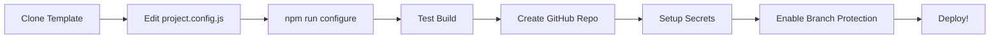

# 🎯 Template Monorepo Angular - Guida Utilizzo

Questo è un **template monorepo Angular** completo e pronto per essere personalizzato per ogni nuovo cliente/progetto.

## 📋 Cosa Include

✅ **Monorepo Structure** - 3 progetti Angular indipendenti
✅ **Tailwind CSS v3** - Utility-first CSS framework
✅ **SCSS Architecture** - Variabili, mixins, functions organizzati
✅ **CI/CD Pipelines** - GitHub Actions workflows completi
✅ **Docker Support** - Multi-stage builds + Docker Compose
✅ **Commitlint + Husky** - Conventional commits enforced
✅ **Branch Protection** - PR reviews required
✅ **Environment Management** - Dev/Prod configurations
✅ **Assets Organization** - public/ folder (Angular 18+)

## 🚀 Setup Nuovo Progetto

### Step 1: Clone il Template

```bash
# Clone questo repository come template
git clone https://github.com/marioscada/cicd-test.git my-new-project
cd my-new-project

# Rimuovi git history e inizia fresh
rm -rf .git
git init
git add .
git commit -m "chore: initial commit from template"
```

### Step 2: Personalizza `project.config.js`

Apri `project.config.js` e modifica **TUTTE** le seguenti sezioni:

#### 2.1 Informazioni Cliente
```javascript
client: {
  name: 'Acme Corp',                     // ← CAMBIA QUESTO
  companyName: 'Acme Corporation',       // ← CAMBIA QUESTO
  website: 'https://acme.com',           // ← CAMBIA QUESTO
  email: 'info@acme.com',                // ← CAMBIA QUESTO
},
```

#### 2.2 Repository
```javascript
repository: {
  name: 'acme-frontend',                 // ← CAMBIA QUESTO
  owner: 'acme-corp',                    // ← CAMBIA QUESTO
  defaultBranch: 'main',                 // ← main o master?
  url: 'https://github.com/acme-corp/acme-frontend',  // ← CAMBIA QUESTO
},
```

#### 2.3 Progetti Angular
```javascript
projects: [
  {
    name: 'customer-portal',             // ← Nome progetto Angular
    displayName: 'Customer Portal',      // ← Nome UI
    description: 'Customer facing portal',
    port: 4200,
    dockerPort: 8081,
    domain: {
      dev: 'dev.portal.acme.com',        // ← Domini
      prod: 'portal.acme.com',
    },
  },
  // ... aggiungi/rimuovi progetti
],
```

#### 2.4 AWS Configuration
```javascript
aws: {
  region: 'us-east-1',                   // ← Regione AWS
  accountId: '123456789012',             // ← AWS Account ID

  s3: {
    devBucketPattern: '{SHA}.dev.{PROJECT}.acme.com',
    prodBucketPattern: '{PROJECT}.acme.com',
  },

  cloudfront: {
    enabled: true,
    devDistributionId: 'E1234567890ABC',  // ← CloudFront ID
    prodDistributionId: 'E0987654321XYZ',
  },
},
```

#### 2.5 Docker Registry
```javascript
docker: {
  registry: 'ghcr.io',                   // ← docker.io, ghcr.io, AWS ECR
  namespace: 'acme-corp',                // ← Docker namespace
  imageNamePattern: '{PROJECT}',
},
```

#### 2.6 Styling (Brand Colors)
```javascript
styling: {
  primaryColor: '#1e40af',               // ← Colore brand primario
  accentColor: '#f59e0b',                // ← Colore accent
  fontFamily: "'Inter', sans-serif",     // ← Font principale
},
```

#### 2.7 Features
```javascript
features: {
  analytics: true,                       // ← Google Analytics?
  darkMode: true,                        // ← Dark mode?
  i18n: true,                            // ← Multilingua?
  pwa: false,                            // ← PWA?
  ssr: false,                            // ← SSR?
},
```

### Step 3: Applica la Configurazione

```bash
npm install
npm run configure
```

Questo script aggiorna automaticamente:
- ✅ `package.json` (name, description, repository)
- ✅ Environment files (`environment.ts`, `environment.prod.ts`)
- ✅ `public/data/config.json` per ogni progetto
- ✅ `tailwind.config.js` (theme colors)
- ✅ SCSS variables (`_variables.scss`)
- ✅ `commitlint.config.js` (allowed scopes)
- ✅ `README.md`

### Step 4: Rinomina Progetti (Opzionale)

Se vuoi rinominare i progetti da `cicd-test` a nomi custom:

```bash
# Esempio: rinominare cicd-test → customer-portal
mv projects/cicd-test projects/customer-portal
```

Poi aggiorna manualmente:
- ✅ `angular.json` - tutte le occorrenze del nome progetto
- ✅ `project.config.js` - array `projects[].name`
- ✅ `package.json` - script npm
- ✅ Workflow files in `.github/workflows/`

### Step 5: Setup GitHub Repository

```bash
# Crea nuovo repository su GitHub
gh repo create acme-corp/acme-frontend --private

# Push
git remote add origin https://github.com/acme-corp/acme-frontend.git
git branch -M main
git push -u origin main
```

### Step 6: Configura GitHub Secrets

Vai su GitHub → Settings → Secrets and variables → Actions:

```
AWS_ACCESS_KEY_ID           = <your-aws-access-key>
AWS_SECRET_ACCESS_KEY       = <your-aws-secret-key>
AWS_REGION                  = us-east-1
S3_BUCKET_DEV               = dev.portal.acme.com
S3_BUCKET_PROD              = portal.acme.com
CLOUDFRONT_DISTRIBUTION_ID  = E1234567890ABC
```

### Step 7: Abilita Branch Protection

Settings → Branches → Add rule → `main`:
- ☑ Require a pull request before merging
- ☑ Require approvals (1)
- ☑ Require status checks to pass
  - Select: `pr-check`, `Unit Tests`, `Lint & Type Check`

### Step 8: Test Everything!

```bash
# Test build locale
npm run build:all

# Test Docker
npm run docker:build:all
npm run docker:up
# Visita http://localhost:8081, 8082, 8083

# Commit e push
git add .
git commit -m "chore: configure for Acme Corp"
git push

# Crea PR per testare CI/CD
git checkout -b feat/customer-portal/test-ci
# ... fai modifiche
git commit -m "feat(customer-portal): test CI/CD"
git push -u origin feat/customer-portal/test-ci
# Crea PR su GitHub
```

## 📂 Struttura File da Personalizzare

### File di Configurazione Centrale
```
project.config.js          ← MODIFICA QUI per ogni cliente!
```

### File Auto-Generati (via npm run configure)
```
package.json               ← Nome, description, repository
README.md                  ← Documentazione auto-generata
tailwind.config.js         ← Theme colors
commitlint.config.js       ← Scopes progetti
projects/*/src/environments/  ← Environment variables
projects/*/public/data/config.json  ← App configs
projects/*/src/styles/_variables.scss  ← SCSS brand colors
```

### File da Personalizzare Manualmente (se necessario)
```
.github/workflows/*.yaml   ← Workflow CI/CD (branch names, etc.)
docker/config/nginx.conf   ← Nginx config
docker/scripts/docker-build.sh  ← Docker build script
angular.json               ← Se rinomini progetti
```

## 🎨 Personalizzazione Styling

### Colori Brand
Nel `project.config.js`:
```javascript
styling: {
  primaryColor: '#your-brand-color',
  accentColor: '#your-accent-color',
}
```

Poi: `npm run configure`

### Tailwind Custom Theme
Modifica `tailwind.config.js` dopo il configure:
```javascript
theme: {
  extend: {
    colors: {
      brand: {
        primary: '#1e40af',
        secondary: '#f59e0b',
        // ... custom colors
      }
    }
  }
}
```

### SCSS Variables
Modifica `projects/*/src/styles/_variables.scss`:
```scss
$primary-color: #1e40af;
$accent-color: #f59e0b;
$font-family-base: 'Inter', sans-serif;
// ... altre variabili
```

## 🔄 Workflow Nuovo Cliente



## 📦 Aggiungere Nuovo Progetto al Monorepo

1. Copia struttura esistente:
```bash
cp -r projects/cicd-test projects/my-new-project
```

2. Aggiungi a `project.config.js`:
```javascript
projects: [
  // ... existing projects
  {
    name: 'my-new-project',
    displayName: 'My New Project',
    description: 'Description',
    port: 4203,
    dockerPort: 8084,
    domain: {
      dev: 'dev.new.example.com',
      prod: 'new.example.com',
    },
  },
],
```

3. Run configure:
```bash
npm run configure
```

4. Aggiungi a `angular.json` (copia sezione esistente e modifica)

5. Aggiungi script a `package.json`:
```json
"start:my-new": "ng serve my-new-project --port 4203",
"build:my-new": "ng build my-new-project --configuration=production"
```

## 🆘 Troubleshooting

### Build fails dopo configure
```bash
rm -rf node_modules package-lock.json
npm install
npm run build:all
```

### Git hooks not working
```bash
npm run prepare
```

### Docker build fails
```bash
# Verifica Docker è running
docker --version

# Rebuild
npm run docker:build:all
```

## 📚 Documentazione Completa

- [MONOREPO.md](MONOREPO.md) - Struttura monorepo
- [docs/DOCKER-MONOREPO.md](docs/DOCKER-MONOREPO.md) - Docker setup
- [docs/AWS-SETUP.md](docs/AWS-SETUP.md) - AWS deployment
- [docs/GITHUB-SETTINGS.md](docs/GITHUB-SETTINGS.md) - GitHub config
- [projects/*/src/styles/README.md](projects/cicd-test/src/styles/README.md) - SCSS architecture
- [projects/*/public/README.md](projects/cicd-test/public/README.md) - Assets organization

## ✅ Checklist Nuovo Progetto

- [ ] Clone template repository
- [ ] Modifica `project.config.js` con dati cliente
- [ ] Run `npm install && npm run configure`
- [ ] Rinomina progetti (se necessario)
- [ ] Test `npm run build:all`
- [ ] Test `npm run docker:build:all`
- [ ] Crea repository GitHub
- [ ] Setup GitHub Secrets (AWS, etc.)
- [ ] Abilita Branch Protection
- [ ] Crea prima PR per testare CI/CD
- [ ] Deploy su AWS (se configurato)
- [ ] Documenta customizzazioni specifiche cliente

## 🎯 Best Practices

1. **NON modificare direttamente** i file generati da `npm run configure`
2. **Modifica sempre** `project.config.js` e poi run configure
3. **Commit** `project.config.js` nel repository cliente
4. **Documenta** customizzazioni specifiche non coperte dal config
5. **Test** sempre dopo configure: build, Docker, CI/CD

---

**Template creato da**: Mariano Scada
**Versione**: 1.0.0
**Data**: Novembre 2025
